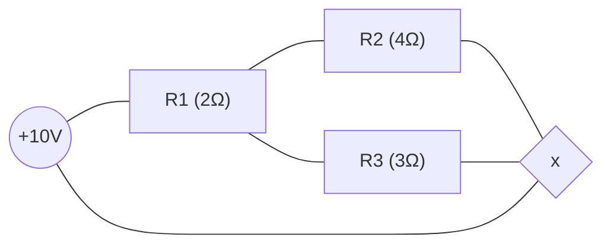

# Electric circuit simulation

Just a toy project that simulates an electric circuit.

## Circuit
This is the hard-coded circuit that is simulated.



And the result (voltage drop for each component):
```
Voltage Generator 0: 10V
Resistor 1: -5.384615384615384V
Resistor 2: -4.615384615384616V
Resistor 3: -4.615384615384616V
```
